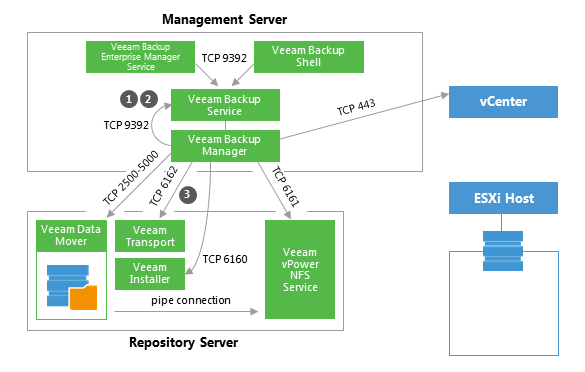
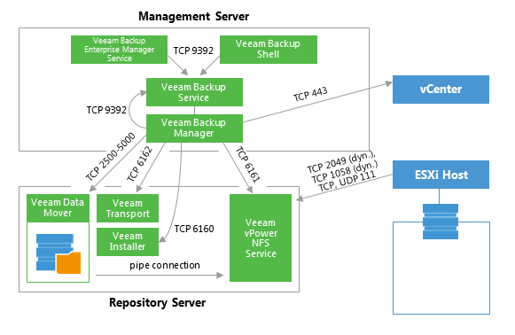
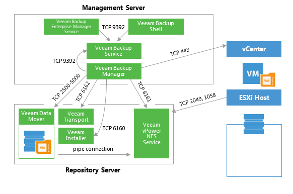

# Instant VM Recovery

This section provides a step-by-step description of the Instant VM
Recovery process implemented in Veeam Backup & Replication.

### 1. Initialization Phase

In the initialization phase, Veeam Backup & Replication prepares
resources necessary for Instant VM Recovery. It performs the following
steps:

1.  Starts the Veeam Backup Manager process on the Veeam backup server.

2.  Checks with the Veeam Backup Service whether the necessary backup
    infrastructure resources are available for instant VM Recovery.

3.  Communicates with the Transport Service on the backup repository to
    start Veeam Data Mover.

### 2. NFS Mapping

When backup infrastructure resources are prepared, Veeam Backup &
Replication maps an empty NFS datastore to the selected ESXi host. It
uses the Veeam vPower NFS Service for this purpose.

Next, Veeam Backup & Replication creates in the Veeam NFS datastore VM
configuration files and links to virtual disk files. Virtual disk files
remain in the backup on the repository, while all changes to these files
are written to the cache file.

### 3. Registering and Starting VM

The VM runs from the Veeam NFS datastore. VMware vSphere treats the
Veeam NFS datastore as any regular datastore. For this reason, with the
recovered VM you can perform all actions that vCenter Server/ESXi
supports for regular VMs.

To migrate VM disk data to a production datastore, use VMware Storage
vMotion or Veeam Quick Migration. For details, see [Veeam Backup &
Replication User
Guide](https://helpcenter.veeam.com/docs/backup/vsphere/migration_job.html?ver=95).

