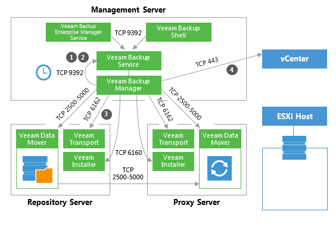
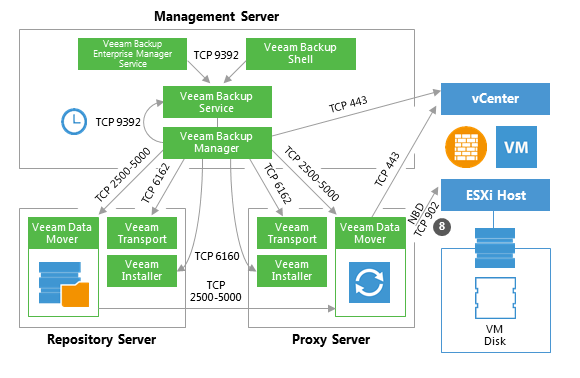
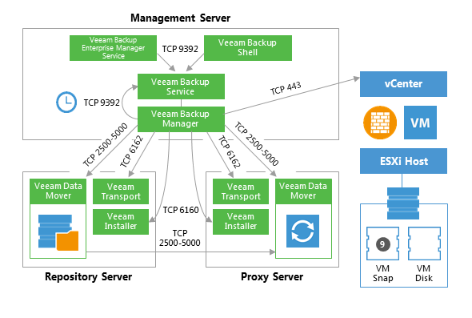
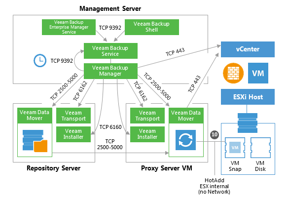
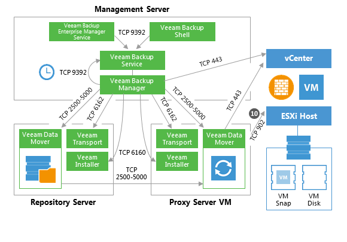
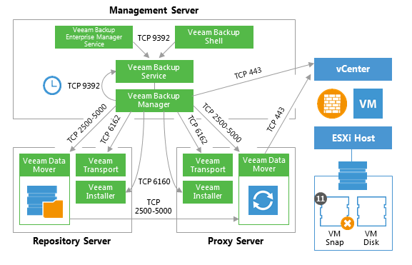

# VM Restore

This section provides a step-by-step description of a full virtual
machine restore process implemented in Veeam Backup & Replication.

### 1. Initialization Phase

In the initialization phase, Veeam Backup & Replication prepares the
resources necessary for full VM recovery. It performs the following
steps:

1.  Starts the necessary processes on the Veeam backup server.

2.  Checks available backup infrastructure resources and assigns a proxy
    server for transferring restored VM data to the
    target host/datastore.

3.  Communicates with Transport Services on the backup proxy and backup
    repository where the backup files reside.\
    Transport Services, in their turn, start Veeam Data Movers. Veeam
    Data Movers on the backup proxy and repository establish a
    connection with each other for data transfer.

4.  Connects to the vCenter Server or ESXi host where the restored VM
    will be registered.

### 2. Restoring VM Configuration

Veeam Backup & Replication retrieves VM configuration data from the
backup and restores it on the chosen ESXi host/datastore. Next, it
instructs VMware vSphere to register the restored VM on the host. If a
user selects to change VM configuration (for example, disk format or
network settings) during restore, Veeam makes the necessary amendments.

### 3. Creating VM Snapshot

Veeam Backup & Replication requests the vCenter Server or ESXi host to
initiate a VM snapshot creation on the restored VM.

**Important!** A snapshot is not taken if a VM is restored to a VVOL
datastore due to vSphere VDDK limitations (see
<http://pubs.vmware.com/Release_Notes/en/developer/vddk/65/vsphere-vddk-650b-release-notes.html>).

### 4. VM Data Transport

Veeam Backup Manager instructs VMware vSphere to create virtual disks
for the VM.

To write VM disk data to the target datastore, Veeam Backup &
Replication can use one of the 3 transport modes:

-   Direct SAN Access

-   Virtual Applicance (HotAdd)

-   Network (NBD)

For more information about each transport mode, see [Veeam Backup &
Replication User
Guide](https://helpcenter.veeam.com/docs/backup/vsphere/transport_modes.html?ver=95)
and the corresponding sections of this document.

### 4a. Direct SAN Access Data Transport Mode

This mode is available only for VMs that have all disks in thick
provisioning.

In the Direct SAN Access mode, Veeam Backup & Replication connects to
the ESXi host where the restored VM is registered. The ESXi host locates
the VM disks, retrieves metadata about the disk layout on the storage,
and sends this metadata to the backup proxy. The backup proxy uses this
metadata to copy VM data blocks to the datastore via SAN.

### 4b. Virtual Appliance Data Transport Mode

In the Virtual Appliance transport mode, VM disks from the backup are
hot-added to a virtualized Veeam backup proxy. The proxy connects to the
ESXi host where the restored VM resides and transfers disk data to the
target datastore through the ESX(i) I/O stack. When the data transfer
process is finished, disks are unmapped from the backup proxy.

### 4c. Network Data Transport Mode

In the Network transport mode, Veeam backup proxy connects to the ESXi
host where the restored VM resides, and writes VM disk data to the
target datastore through the LAN channel.

### 5. Committing VM Snapshot

After the proxy finishes writing VM disk data, Veeam Backup &
Replication requests the vCenter Server or ESXi host to initiate a
snapshot commit for the restored VM.

